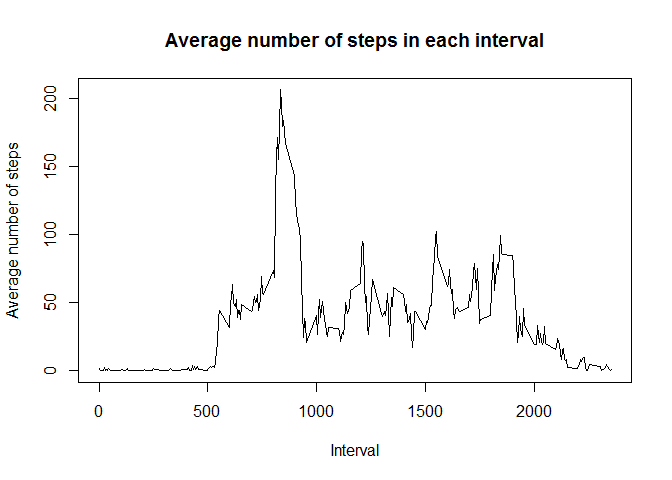
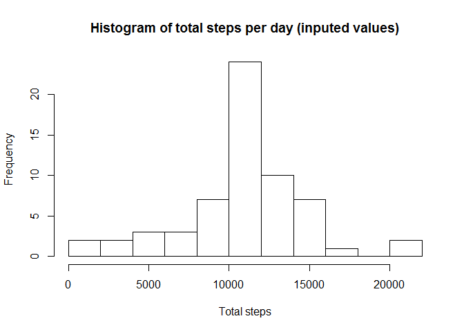

# Reproducible Research: Peer Assessment 1


## Loading and preprocessing the data


```r
library(ggplot2)
library(plyr)

Sys.setlocale("LC_TIME", "English")
```

```
## [1] "English_United States.1252"
```

```r
df <- read.csv("./activity.csv", stringsAsFactors = FALSE)
df[,2] <- as.Date(df[,2])
```

## What is mean total number of steps taken per day?


```r
hist(df$steps, breaks=100)
```

 

```r
mean(df$steps, na.rm=T)
```

```
## [1] 37.3826
```

```r
median(df$steps, na.rm=T)
```

```
## [1] 0
```

## What is the average daily activity pattern?

```r
interval_avg <- tapply(df$steps, df$interval, function(x) mean(x, na.rm=T))
plot(unique(df$interval), interval_avg, type="l")
```

 

```r
df$interval[which(interval_avg==max(interval_avg))]
```

```
## [1] 835
```


## Imputing missing values

```r
missing_case_ind <- which(!complete.cases(df))
interval_avg_df <- data.frame(interval = names(interval_avg), avg = interval_avg)

int_avg <- merge(df[missing_case_ind,],interval_avg_df)
int_avg <- int_avg[order(int_avg$date),]

df_inp <- df
df_inp$steps[missing_case_ind] <- int_avg$avg
```


```r
hist(df_inp$steps, breaks=100)
```

 

```r
mean(df_inp$steps, na.rm=T)
```

```
## [1] 37.3826
```

```r
median(df_inp$steps, na.rm=T)
```

```
## [1] 0
```

```r
sum(df$steps, na.rm=T)
```

```
## [1] 570608
```

```r
sum(df_inp$steps, na.rm=T)
```

```
## [1] 656737.5
```


## Are there differences in activity patterns between weekdays and weekends?

```r
x <- rep("weekday", dim(df_inp)[1])
x[weekdays(df_inp$date) == "Saturday" | weekdays(df_inp$date) == "Sunday"] <- "weekend"
df_inp$day_type <- factor(x)

df_inp_avg <- ddply(df_inp, .(interval, day_type), function(x) mean(x[,1], na.rm=T))
names(df_inp_avg)[3] <- "steps"
p1 <- ggplot(df_inp_avg, aes(interval, steps))
p1 + geom_line() + facet_grid(day_type ~ .)
```

 

